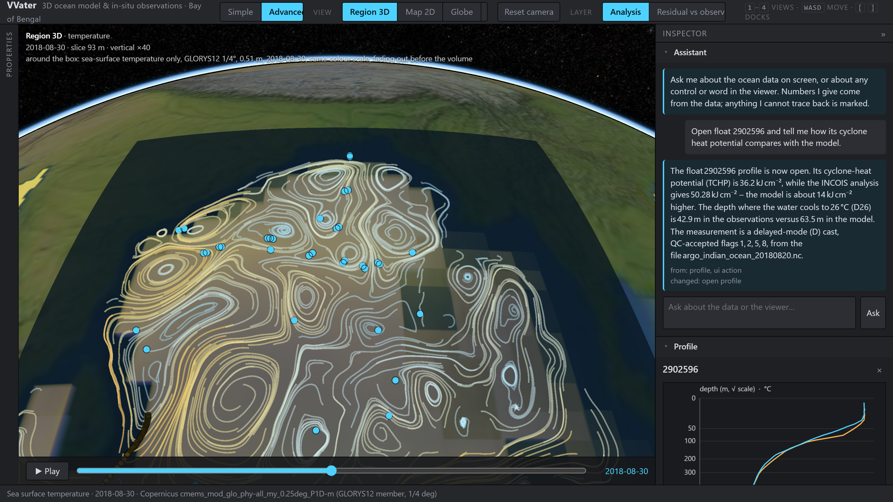
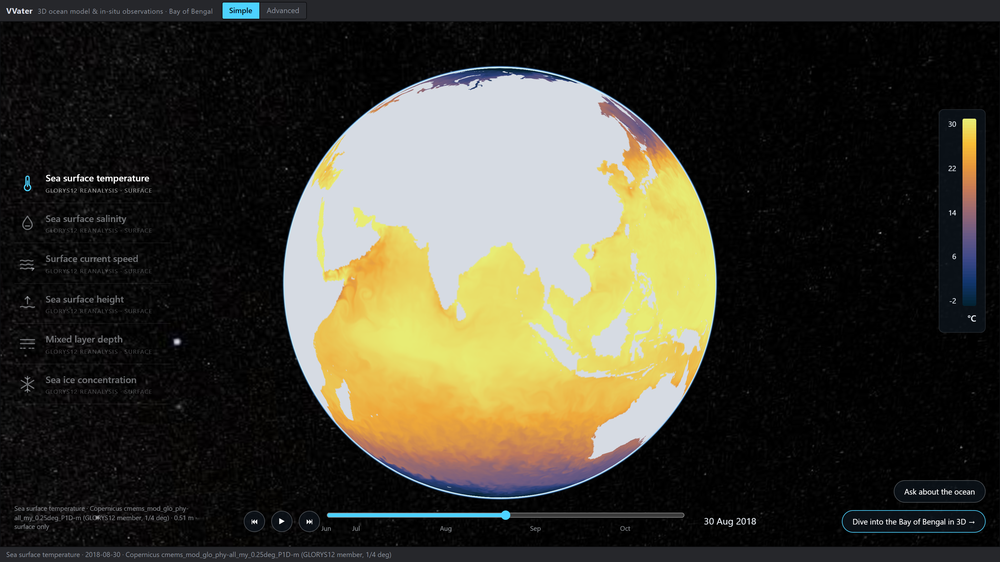
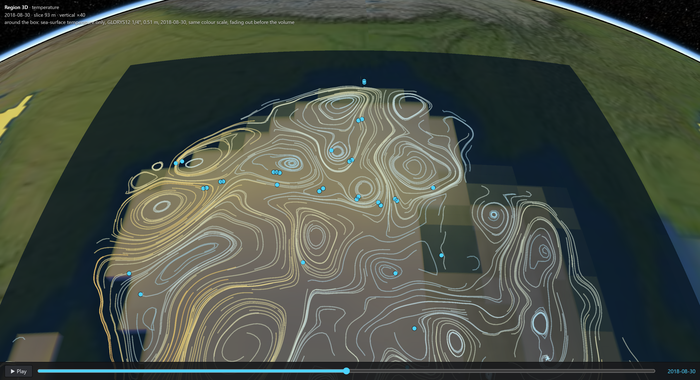
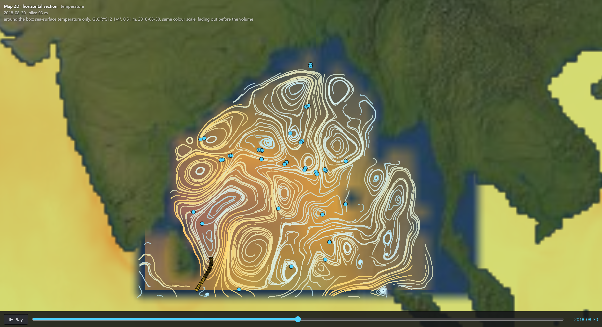
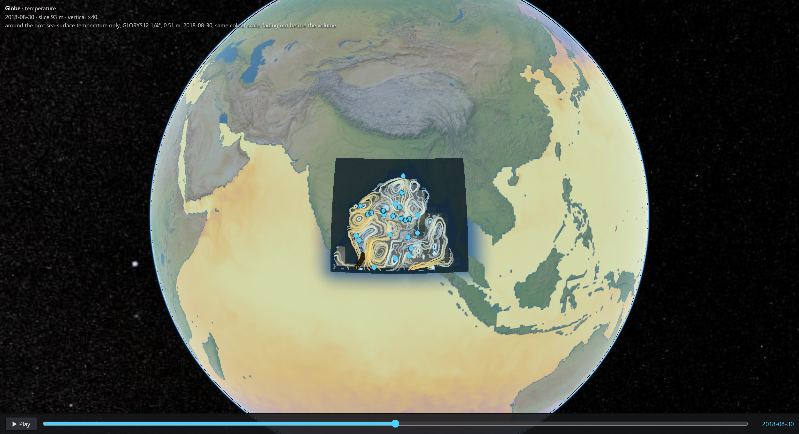
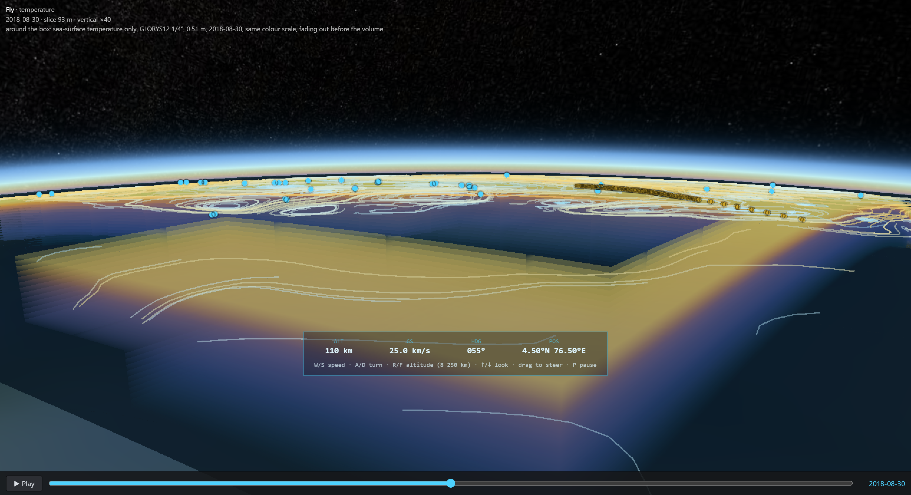
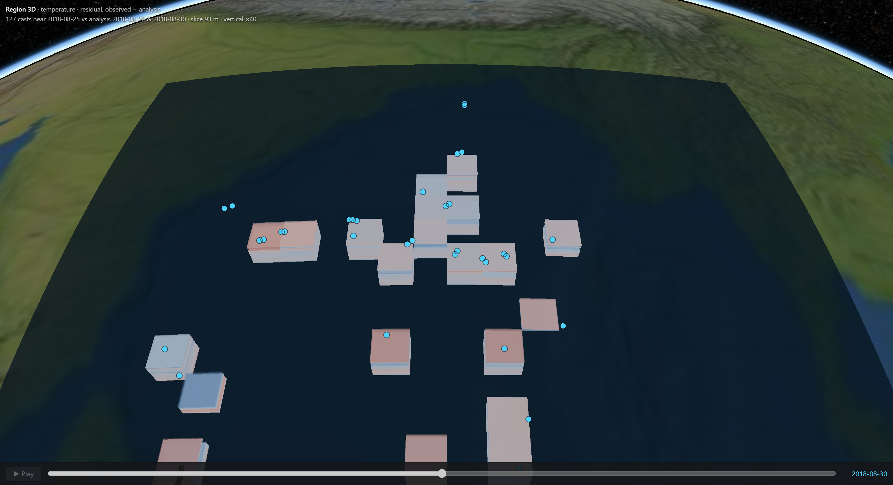

# VVater — the ocean in 3D, in a browser

SIH 2026 · Problem Statement 26067 · INCOIS / Ministry of Earth Sciences · Disaster Management

A browser-native platform that renders INCOIS ocean model fields as a **3D volume** —
temperature and salinity through the whole water column of the Bay of Bengal — and draws
every **Argo float and glider** into the same scene, so the forecast and the instruments
that test it can be seen, and compared, together. No install, no plug-in, no account.



## Two modes

**Simple** — the whole ocean on a globe, one layer at a time (sea surface temperature,
salinity, current speed, sea surface height, mixed layer depth, sea ice), a colour bar and a
timeline. For a first look, an exhibition screen or a classroom.



**Advanced** — the Bay of Bengal as a volume, 5–2,000 m, with the instruments, the controls
and the inspector. Four views of the same data:

| Region 3D | Map 2D |
|---|---|
|  |  |
| **Globe** | **Fly** |
|  |  |



## What it does

- **3D volume** — CesiumJS voxel raymarching with our own transfer function: depth slice,
  isosurface (with a 20 °C isotherm preset), time animation, vertical exaggeration, colour
  bar editor (palette, range, log/linear), opacity, and uncertainty fade from the analysis's
  own error field.
- **Instruments in the same scene** — click any float or glider for its depth profile
  against the model, always with its QC flag, data mode and source file. Rejected levels are
  drawn, never dropped. Add your own casts from a CSV/TSV file.
- **Where the model is wrong** — the residual (observed minus modelled) as its own 3D
  layer. Only a few percent of the volume was ever measured; the rest stays visibly empty.
- **Cyclone heat potential** — every comparison is also given in kJ/cm².
- **Currents** — streamlines at the slice depth, integrated on the server.
- **The world around it** — global surface layers at 1/4°, on the Bay's timeline.
- **Assistant** — ask about the data or any control in plain words. It answers through the
  same functions the API serves, every number it states is checked against the data it came
  from, and it can move the view for you (set a depth, open a float, switch views).
- **Camera** — orbit camera with **W A S D** / **Q E** / **R F** and a zoom limit in Region
  3D; a constant-altitude flight camera in Fly. Graphics auto-tune to 60 fps and sharpen to
  full resolution when the scene is still.
- **Open standards** — CF-aware NetCDF ingest, OGC WMS 1.3.0 (opens in QGIS).

## Run it

```
python -m venv .venv && .venv/Scripts/pip install -r server/requirements.txt
python -m server.tools.fetch_fixtures             # real files the tests run against
python -m pytest server/tests -q                  # tests
python -m server.ocean.globalsurface --warm       # global layers, once (Copernicus login)
python -m uvicorn server.ocean.api:app --port 8011
cd viewer && npm install && npm run dev           # http://localhost:5173
```

Credentials go in `.env` (see `.env.example`). The INCOIS data needs none. Copernicus
(currents and the global layers) needs a free Copernicus Marine account; the assistant needs
a Groq API key. Without either, the rest of the viewer works and the missing parts say why.

## Stack

CesiumJS · TypeScript · Vite · Python · FastAPI · xarray · NumPy · TEOS-10 (`gsw`) ·
Copernicus Marine toolbox · Groq (OpenAI-compatible chat completions with tool calls).

## Data

INCOIS ERDDAP Argo variational analysis (primary) · Copernicus GLORYS12 and its 1/4° global
member · Argo GDAC over HTTPS · U.S. IOOS Glider DAC. Every source is probed, not assumed:
`docs/05-data-sources.md`.

## Documents

Start at `docs/00-start-here.md`. The limits are in `docs/03-limitations.md`, every measured
number in `docs/13-eval-results.md` (generated, never hand-edited), what is knowingly
incomplete in `docs/11-deferred.md`, and how to use the viewer in `docs/17-user-guide.md`.
