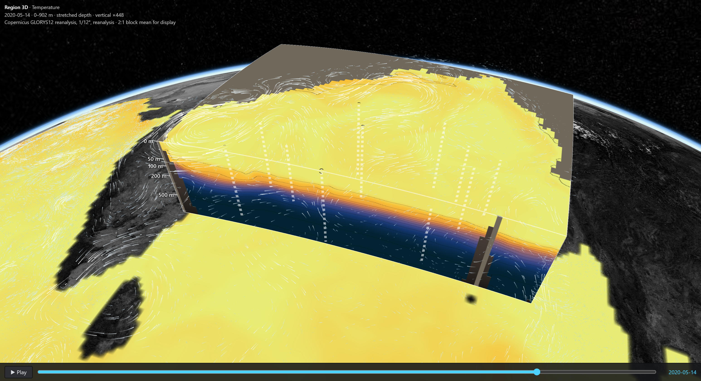
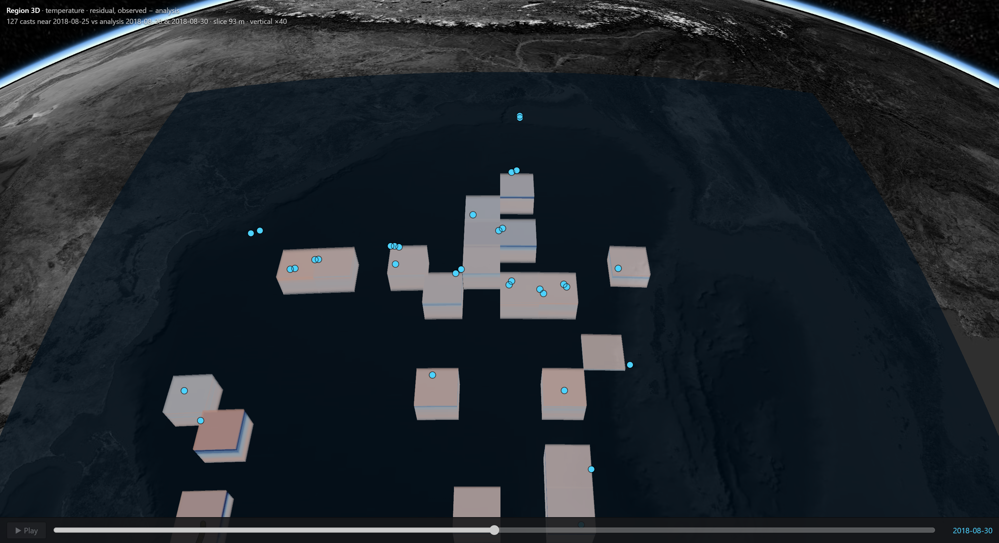
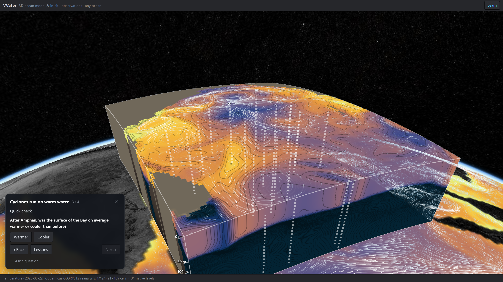
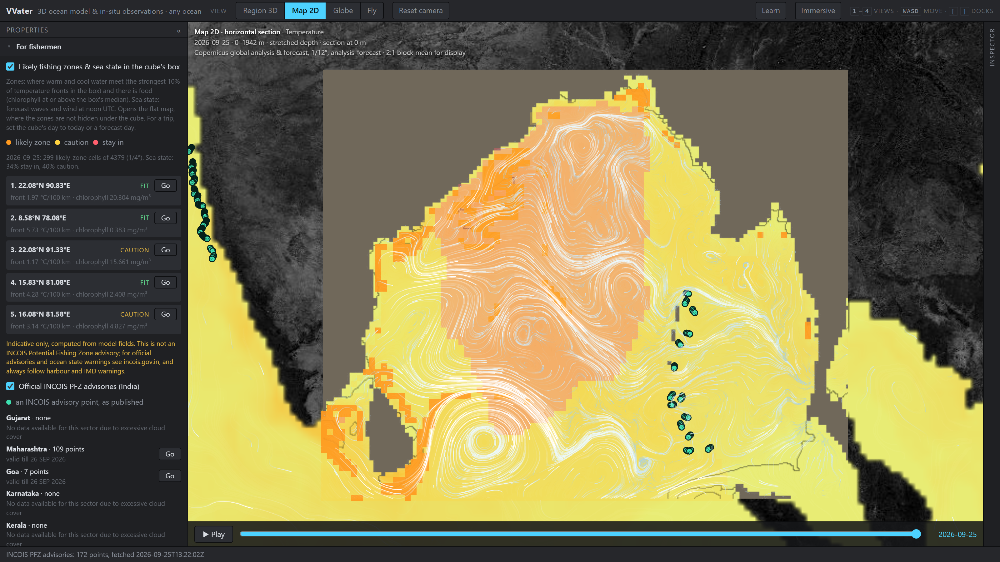
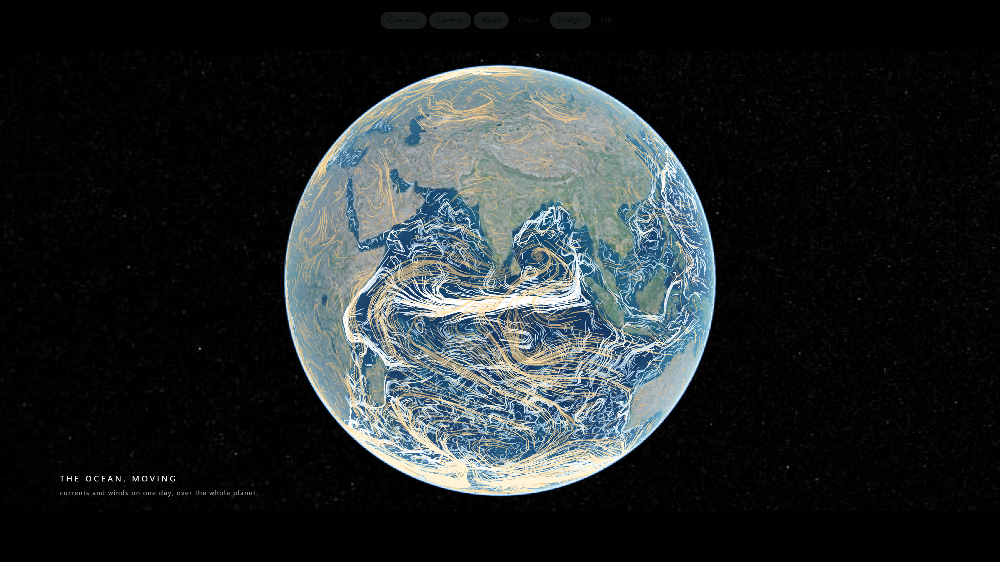
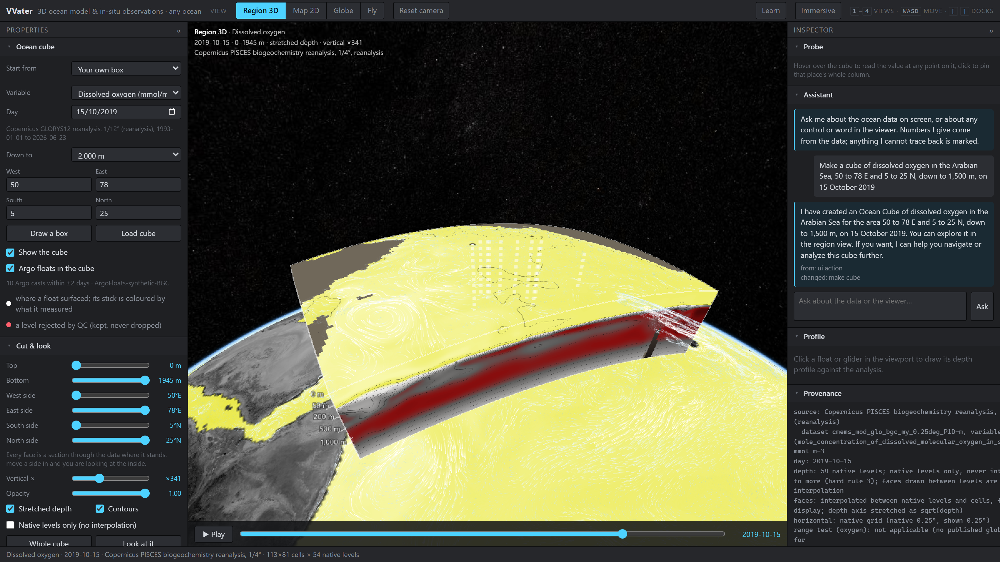

# VVater — the ocean in 3D, in a browser

SIH 2026 · Problem Statement 26067 · INCOIS / Ministry of Earth Sciences · Disaster Management

A browser-native platform where you **cut a block out of the ocean anywhere on Earth, on
any day from 1993 to nine days ahead, and look at it from the side**: temperature,
salinity, density, sound speed, currents, oxygen, chlorophyll, nutrients, pH and carbon,
through the whole water column on the model's own levels. Real **Argo floats** stand inside
the block, coloured by what they measured, and the rest of the planet is painted with the
same variable and colour bar, with that day's currents flowing over it. No install, no
plug-in, no account.

## The Ocean Cube




- **Anywhere, any day**: Copernicus Marine models read straight from their cloud stores,
  1993 to the forecast horizon, 23 variables, labelled reanalysis, analysis or forecast.
- **Cut it open**: every face is a section through the data; move any side inwards to see
  inside. Stretched or true depth, contours, or the model's native levels only.
- **Floats inside the water**: global core and BGC Argo, QC flags, data mode and source file
  on every cast; click one to compare it with the model on its own day.
- **The whole ocean around it**, on the same colour bar, with animated currents.
- Nine scenarios to start from, including Cyclone Amphan before and after, or drag your own
  box on the globe. The URL carries the view.

## The INCOIS Bay of Bengal volume


The Bay of Bengal as a voxel volume, 5–2,000 m, with the instruments, the controls and the
inspector, behind *INCOIS Bay volume*. The residual layer: measured minus modelled, one
block per place somebody measured, and nothing where nobody did.



| Learn | For fishermen |
|---|---|
|  |  |
| **Immersive** | **The assistant** |
|  |  |

## What it does

- **3D volume** — CesiumJS voxel raymarching with our own transfer function: depth slice,
  isosurface (with a 20 °C isotherm preset), time animation, vertical exaggeration, colour
  bar editor (palette, range, log/linear), opacity, and uncertainty fade from the analysis's
  own error field.
- **Instruments in the same scene** — click any float or glider for its depth profile
  against the model, always with its QC flag, data mode and source file. Rejected levels are
  drawn, never dropped. Add your own casts from a CSV/TSV file.
- **Where the model is wrong** — the residual (observed minus modelled) as its own 3D
  layer. Only a few percent of the volume was ever measured; the rest stays visibly empty.
- **Cyclone heat potential** — every comparison is also given in kJ/cm².
- **Currents** — streamlines at the slice depth, integrated on the server.
- **The world around it** — global sea-surface temperature at 1/4°, on the Bay's timeline.
- **Assistant** — ask about the data or any control in plain words. It answers through the
  same functions the API serves, every number it states is checked against the data it came
  from, and it can move the view for you (set a depth, open a float, switch views).
- **Camera** — orbit camera with **W A S D** / **Q E** / **R F** and a zoom limit in Region
  3D; a constant-altitude flight camera in Fly. Graphics auto-tune to 60 fps and sharpen to
  full resolution when the scene is still.
- **Open standards** — CF-aware NetCDF ingest, OGC WMS 1.3.0 (opens in QGIS).

## Run it

```
python -m venv .venv && .venv/Scripts/pip install -r server/requirements.txt
python -m server.tools.fetch_fixtures             # real files the tests run against
python -m pytest server/tests -q                  # tests
python -m server.tools.warm_scenarios            # pre-fetch the nine scenarios, once
python -m uvicorn server.ocean.api:app --port 8011
cd viewer && npm install && npm run dev           # http://localhost:5173
```

One click: `start.bat` on Windows, `./start.sh` on macOS and Linux. Each runs the last two lines and opens the browser.

Credentials go in `.env` (see `.env.example`). The INCOIS data needs none. Copernicus
(currents and the global layers) needs a free Copernicus Marine account; the assistant needs
an AIRouter API key (`AI_ROUTER_KEY`). Without either, the rest of the viewer works and the missing parts say why.

## Stack

CesiumJS · TypeScript · Vite · Python · FastAPI · xarray · NumPy · TEOS-10 (`gsw`) ·
Copernicus Marine toolbox · AIRouter (OpenAI-compatible chat completions with tool calls).

## Data

Copernicus Marine ARCO stores (GLORYS12 reanalysis, global analysis & forecast, L4 winds, global wave forecast, PISCES
biogeochemistry) · NCEP GFS wind forecast via UCAR THREDDS · NASA GIBS Blue Marble relief · INCOIS PFZ advisories · INCOIS ERDDAP Argo analyses · Argo GDAC over HTTPS and Ifremer ERDDAP ·
U.S. IOOS Glider DAC. Every source is probed, not assumed:
`docs/05-data-sources.md`.

## Documents

Start at `docs/00-start-here.md`. The limits are in `docs/03-limitations.md`, every measured
number in `docs/13-eval-results.md` (generated, never hand-edited), what is knowingly
incomplete in `docs/11-deferred.md`, and how to use the viewer in `docs/17-user-guide.md`.
