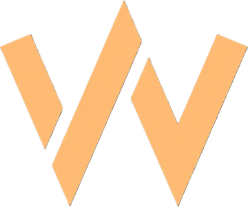
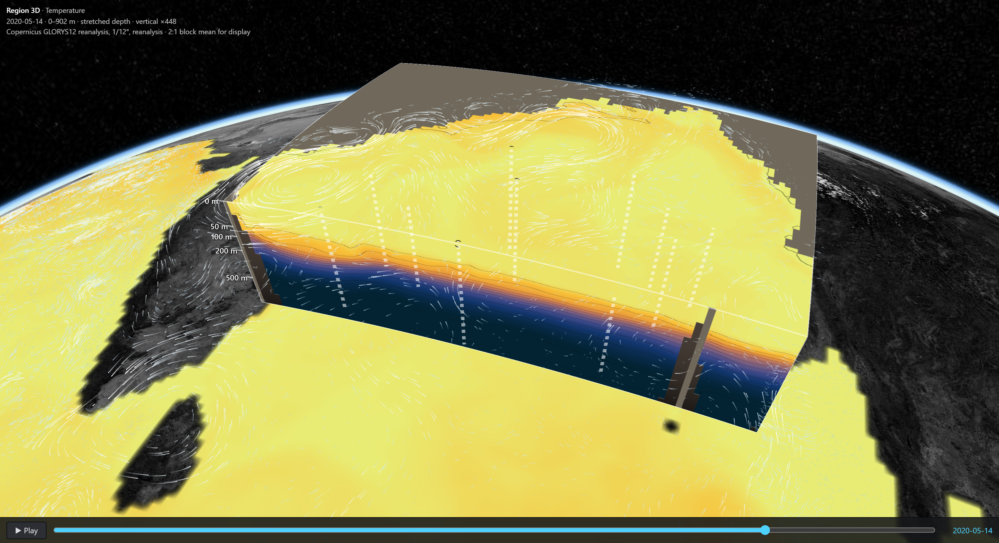
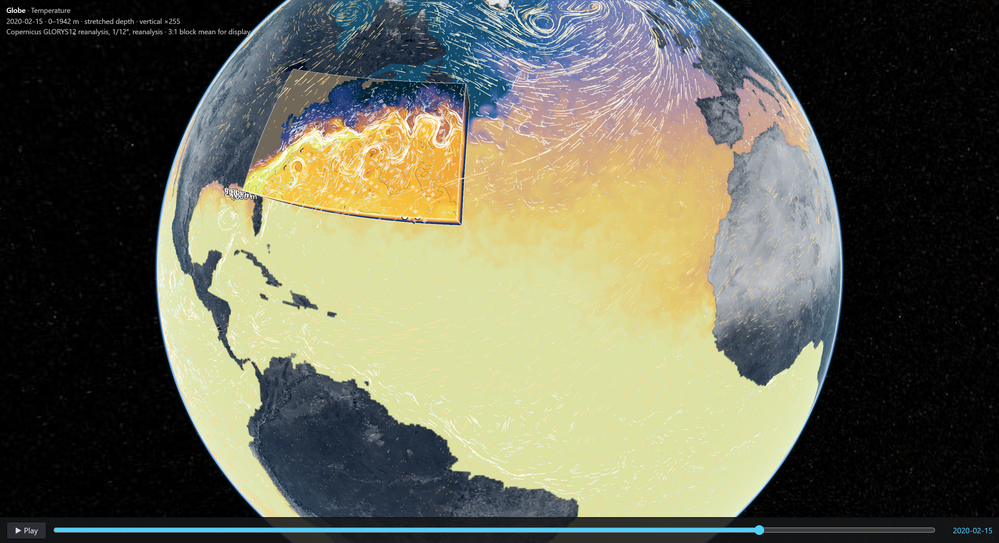
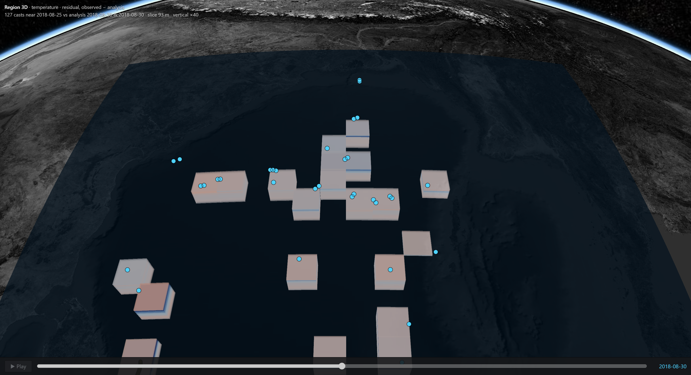
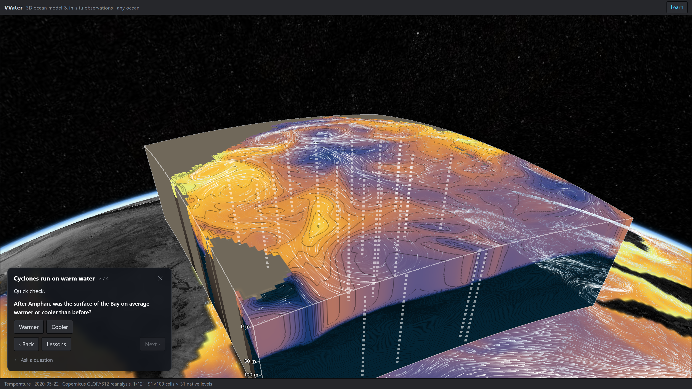
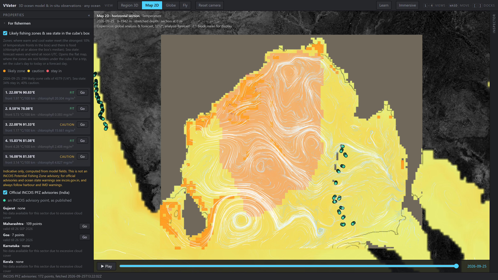
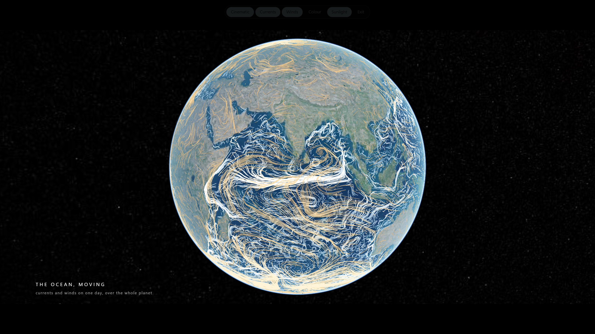
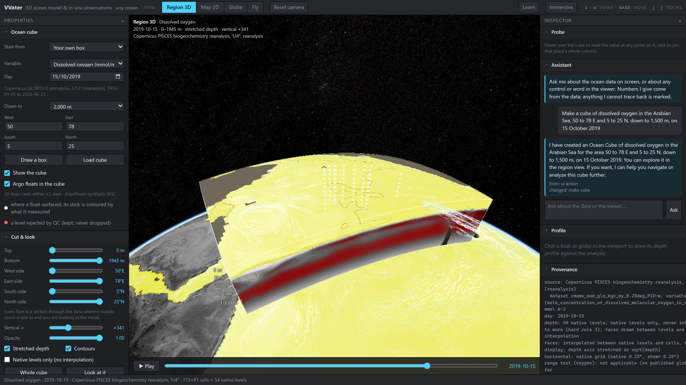
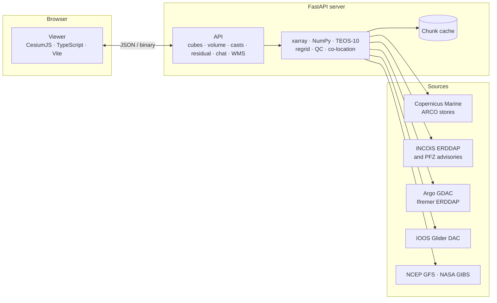

<p align="center">
  
</p>

<h1 align="center">VVater</h1>

<p align="center">
  <b>Cut the ocean open in 3D, and see where the model and the real instruments disagree.</b><br>
  A browser-native platform for ocean model fields and in-situ observations, in one scene.
</p>

<p align="center">
  <a href="https://v-vater.vercel.app"></a>
  <a href="LICENSE"></a>
  
  
  
  
</p>

<p align="center">
  <a href="https://v-vater.vercel.app">Live demo</a> ·
  <a href="docs/17-user-guide.md">User guide</a> ·
  <a href="docs/13-eval-results.md">Measured results</a> ·
  <a href="docs/05-data-sources.md">Data sources</a>
</p>

<p align="center"><sub>Smart India Hackathon 2026 · Problem Statement 26067 · INCOIS, Ministry of Earth Sciences · Disaster Management</sub></p>

---



## Contents

- [Overview](#overview)
- [Highlights](#highlights)
- [Features](#features)
- [What it found](#what-it-found)
- [Measured performance](#measured-performance)
- [Architecture](#architecture)
- [Getting started](#getting-started)
- [Configuration](#configuration)
- [API](#api)
- [Data sources and acknowledgements](#data-sources-and-acknowledgements)
- [Known limitations](#known-limitations)
- [Documentation](#documentation)
- [License](#license)

## Overview

Almost every picture of the ocean is a map of its surface. What matters for cyclones,
fisheries and climate sits underneath: the warm upper layer a cyclone draws on, the
thermocline, the oxygen-poor layers, the edges of currents. INCOIS already produces this
information every day as 3D model fields, and Argo floats and gliders measure it directly.
Until now, seeing the two together meant flat slices in one program, profiles in another,
and lining them up by eye.

VVater puts them in one place, in an ordinary web browser, with nothing to install:

1. **Draw a box** anywhere on the globe.
2. **Pick a day**, from 1993 to nine days ahead, and one of **23 variables**.
3. The box is lifted out as a **3D block**, standing on the sea surface and coloured at
   every depth the model actually has.
4. **Cut into it** from any side. The faces become sections through the water column.
5. **Real floats stand inside it.** Click one to compare its readings against the model on
   the float's own day.

## Highlights

| | |
|---|---|
| **Anywhere, any day** | Copernicus Marine reanalysis, analysis and forecast, read chunk by chunk from the cloud stores. Nothing is archived in advance. |
| **Native levels only** | The block never has more depth levels than the source. No thermocline structure is invented between them. |
| **Observations with provenance** | Every reading carries its QC flag, data mode and source file. Readings that fail QC are drawn as rejected, never dropped. |
| **Model checked against instruments** | Model-minus-observation error by depth, as a chart and as a 3D residual layer. Cells nobody measured stay empty. |
| **Model checked for QC too** | The Argo global range test is applied to the model field itself; failing cells are masked and counted. |
| **Built for four audiences** | Forecasters, fishermen, students and the public, each with their own view. |
| **Plain-language assistant** | Ask a question and it builds the view, through the same API the viewer uses. |
| **Open standards** | CF-aware NetCDF ingest and an OGC WMS 1.3.0 endpoint that opens in QGIS. |

## Features

### The Ocean Cube



- **23 variables**: temperature, salinity, density and sound speed (derived with TEOS-10),
  currents, oxygen, chlorophyll, nutrients, pH, dissolved inorganic carbon, alkalinity and
  more, each labelled as reanalysis, analysis or forecast. 17 of them go back to 1993.
- **Cut and look**: move any face inwards; switch between stretched and true depth; add
  contours; show the model's native levels only.
- **Controls**: variable, day, depth, a cut for every side, vertical exaggeration, opacity,
  and an editable colour bar (palette, range, linear or log).
- **Time**: press Play to step through the days.
- **The whole ocean around it**: the rest of the planet is painted with the same variable
  on the same colour bar, with that day's currents and winds flowing over it, so a colour
  means the same value inside the block and out.
- **Nine scenarios** to start from, including Cyclone Amphan before and after, or drag your
  own box. The URL carries the view, so any view can be shared as a link.

### Instruments in the same scene

- **Argo floats** (core and BGC, global) stand inside the block at the place and depth
  they sampled. Clicking one opens its profile beside the model's, on the float's own day.
- **Gliders, RAMA moorings and CTD casts** load the same way, and you can drop in your own
  CSV/TSV file of casts.
- **Provenance on every level**: QC flag, data mode (real-time, adjusted, delayed) and the
  source file. Around Amphan, 17 floats reported and 201 of their levels failed QC; all
  201 are drawn as rejected.

### The INCOIS Bay of Bengal volume



The INCOIS Argo 10-day variational analysis for the Bay of Bengal (78–100°E, 5–23°N,
5–2,000 m) as a voxel volume, with its own layers and inspector:

- **Residual layer**: observed minus modelled, one block per place somebody measured and
  nothing where nobody did.
- **Uncertainty fade** from the analysis's own error field, so uncertain water looks faint.
- **Cyclone heat potential**: every comparison is also given in kJ/cm².
- **Currents** as streamlines at the slice depth, integrated on the server.
- An isosurface with a **20 °C isotherm preset**, the depth of warm water available to a
  cyclone.

### Views, fishermen, learning and the assistant

| Learn | For fishermen |
|---|---|
|  |  |
| **Immersive** | **The assistant** |
|  |  |

- **Four views**, one key each: Region 3D orbits the block, Map 2D lays its top flat,
  Globe shows the whole planet, and Fly holds a constant altitude a few kilometres up.
  Orbit with **W A S D**, **Q E** and **R F**.
- **For fishermen**: INCOIS Potential Fishing Zone advisories, all 14 sectors, read exactly
  as published, next to sea state. Elsewhere an indicative layer from sea-surface fronts
  and chlorophyll, labelled everywhere as not an advisory.
- **Learn**: a six-lesson course for classes 8 to 12 on the real data. Quiz answers are
  worked out from the block on screen.
- **Immersive view** (key **I**): a cinematic tour of one day of the planet's currents and
  winds, lit by the real sun.
- **Assistant**: ask in plain words ("show me oxygen in the Arabian Sea") and it answers
  and builds the view. It reads data only through the viewer's own API, can touch only a
  fixed list of controls, and any number it states that cannot be traced to a tool result
  is flagged on screen.
- **Performance**: graphics auto-tune to 60 fps and sharpen to full resolution when the
  scene is still.

## What it found

Comparing the INCOIS Bay of Bengal analysis with Argo floats and an independent glider,
level by level (centre date 2018-08-25, pairing ±5 days):

| Depth | RMSE vs Argo (°C) | RMSE vs glider (°C) |
|---|---:|---:|
| 0–300 m | 1.26 | **2.89** |
| 300–950 m | 0.35 | 0.31 |
| 950–2,000 m | 0.19 | 0.23 |

Below 300 m the model is good. In the top 300 m, the layer a cyclone feeds on, the error
against the glider is 2.89 °C. The glider's data never went into the analysis, which
makes it an independent check; most Argo floats were assimilated, so the Argo column is a
consistency check. Averaged over all depths, this disappears. Drawn as a column, it is
obvious.

The model field also needed QC. One analysis step has water at **44.42 °C**, 75–100 m
down. The Argo global range test (−2.5 to 40 °C) catches 6 of 68,022 cells, which are
masked; 18 more are impossible at that depth but pass the test, and are logged rather
than filtered by an invented limit.

Every figure here is produced by the evaluation harness and recorded in
[`docs/13-eval-results.md`](docs/13-eval-results.md).

## Measured performance

| | |
|---|---|
| Cube from disk cache (Amphan, 91 × 109 cells, 28 levels) | 0.08 s |
| Cold cube from Copernicus (six regions worldwide) | 2.7–15.6 s |
| Assistant builds the requested cube | 5 of 5 runs, median 4.6 s |
| Full test session against one server | 97 of 97 requests answered |
| Server memory | 128 MB idle, 639 MB peak |
| Server boot | 1.6 s |

Re-run everything with one command:

```
python -m server.eval.run_eval --json
```

## Architecture


```mermaid
flowchart LR
  subgraph Browser
    V[Viewer<br/>CesiumJS · TypeScript · Vite]
  end
  subgraph Server[FastAPI server]
    A[API<br/>cubes · volume · casts · residual · chat · WMS]
    X[xarray · NumPy · TEOS-10<br/>regrid · QC · co-location]
    C[(Chunk cache)]
  end
  subgraph Sources
    CM[Copernicus Marine<br/>ARCO stores]
    IN[INCOIS ERDDAP<br/>and PFZ advisories]
    AR[Argo GDAC<br/>Ifremer ERDDAP]
    GL[IOOS Glider DAC]
    WX[NCEP GFS · NASA GIBS]
  end
  V <-- JSON / binary --> A
  A --> X --> C
  X --> CM & IN & AR & GL & WX
```

- **Viewer**: CesiumJS's voxel ray-marcher runs a custom shader and transfer function; the
  cube's faces are painted from the model's native levels.
- **Server**: reads only the chunks a box needs, masks impossible values, builds the
  block on native levels, derives density and sound speed with TEOS-10, and pairs every
  observation with the model. Every normalisation the ingest had to assume is recorded
  and travels with the data.
- **TLS**: INCOIS serves an incomplete certificate chain. The server uses `truststore`
  and a bundled intermediate; certificate verification is never disabled.

### Repository layout

```
server/
  ocean/        API, readers for each source, cube and volume builders, QC, assistant
  eval/         evaluation harness (every quoted number comes from here)
  tests/        pytest suite and fixtures
  tools/        fixture fetch, scenario warm-up, hosting measurement
viewer/
  src/          Cesium scene, cube, voxels, currents, profile, learn, chat
data/           harness output (eval-latest.json, hosting-latest.json, ...)
deploy/         container for hosting the server
docs/           user guide, data sources, limitations, results, deployment
```

## Getting started

### Prerequisites

- Python 3.14
- Node.js 20.19 or newer
- Optional: a free [Copernicus Marine](https://data.marine.copernicus.eu) account for the
  global cubes, currents and surrounding layers; an AIRouter key for the assistant.
  The INCOIS data needs no credentials, and anything missing is explained in the viewer.

### One click

`start.bat` on Windows, `./start.sh` on macOS and Linux. Each starts the API on port 8011
and the viewer on port 5173, then opens the browser.

### Manual setup

```
python -m venv .venv
.venv/Scripts/pip install -r server/requirements.txt     # .venv/bin/pip on macOS/Linux
python -m server.tools.fetch_fixtures                    # real files the tests run against
python -m pytest server/tests -q                         # tests
python -m server.tools.warm_scenarios                    # pre-fetch the nine scenarios, once
python -m uvicorn server.ocean.api:app --port 8011
cd viewer && npm install && npm run dev                  # http://localhost:5173
```

## Configuration

Copy `.env.example` to `.env` in the repository root.

| Variable | Needed for |
|---|---|
| `COPERNICUSMARINE_SERVICE_USERNAME`, `COPERNICUSMARINE_SERVICE_PASSWORD` | Global cubes, currents and the layers around the block |
| `AI_ROUTER_KEY` | The assistant (`/api/chat`) |
| `AI_ROUTER_MODEL` | Optional. Comma-separated models, tried in order |
| `ALLOWED_ORIGINS`, `ALLOWED_ORIGIN_REGEX` | Optional. CORS for a hosted viewer |

The viewer reads `VITE_API_BASE` (the server's HTTPS address) and `VITE_CESIUM_ION_TOKEN`
at build time. Hosting both halves is covered in [`docs/18-deploy.md`](docs/18-deploy.md).

## API

All endpoints are `GET` unless marked.

| Group | Endpoints |
|---|---|
| Cube (anywhere) | `/api/catalog` · `/api/cube/meta` · `/api/cube/data` · `/api/cube/casts` · `/api/cube/profile` · `/api/cube/currents/meta` · `/api/cube/currents/data` |
| INCOIS Bay volume | `/api/meta` · `/api/volume/meta` · `/api/volume/data` · `/api/residual/meta` · `/api/residual/data` · `/api/streamlines` |
| Observations | `/api/instruments` · `/api/observations` · `/api/profile` · `POST /api/casts` (upload your own) |
| Whole ocean | `/api/global/layers` · `/api/global/meta` · `/api/global/data` · `/api/surface/meta` · `/api/surface/data` · `/api/surface/currents/meta` · `/api/surface/currents/data` · `/api/wind/meta` · `/api/wind/data` |
| Fishermen | `/api/pfz` · `/api/fishing` · `/api/seastate` |
| Other | `POST /api/chat` · `/api/geocode` · `/api/health` · `/wms` (OGC WMS 1.3.0) |

## Data sources and acknowledgements

- **Copernicus Marine Service**: GLORYS12 reanalysis, global analysis and forecast
  (physics and PISCES biogeochemistry), L4 winds, global wave forecast.
- **INCOIS**: Argo 10-day variational analysis via ERDDAP, and Potential Fishing Zone
  advisories.
- **Argo**: these data were collected and made freely available by the International Argo
  Program and the national programs that contribute to it (https://argo.ucsd.edu,
  https://www.ocean-ops.org). The Argo Program is part of the Global Ocean Observing
  System. Accessed through the Argo GDAC and Ifremer ERDDAP.
- **U.S. IOOS Glider DAC** for glider profiles; **RAMA** moorings.
- **NCEP GFS** wind forecast via UCAR THREDDS; **NASA GIBS** Blue Marble relief.

Every source was probed rather than assumed; the probes and their results are in
[`docs/05-data-sources.md`](docs/05-data-sources.md).

## Known limitations

- **Gliders are nearly absent in the Bay of Bengal**: of 2,562 datasets in the U.S. glider
  archive, one flies inside it. Europe's glider archive is not connected yet.
- **A depth-aware range test needs a published limit.** Until one exists, the 18
  impossible-but-passing model cells are logged, not filtered.
- **The live site's data server is a single machine the team runs.** If the site says it
  is asleep, press *Message server*; the page resumes on its own once the API answers.

The full list, with what each limit forces, is in
[`docs/03-limitations.md`](docs/03-limitations.md) and
[`docs/11-deferred.md`](docs/11-deferred.md).

## Documentation

| Document | Contents |
|---|---|
| [`docs/17-user-guide.md`](docs/17-user-guide.md) | How to use every part of the viewer |
| [`docs/05-data-sources.md`](docs/05-data-sources.md) | Every source, probed rather than assumed |
| [`docs/03-limitations.md`](docs/03-limitations.md) | Structural limits and the constraint each one forces |
| [`docs/13-eval-results.md`](docs/13-eval-results.md) | Every measured number, generated by the harness |
| [`docs/10-unsourced.md`](docs/10-unsourced.md) | Choices with no published value behind them, stated openly |
| [`docs/11-deferred.md`](docs/11-deferred.md) | What is knowingly incomplete |
| [`docs/18-deploy.md`](docs/18-deploy.md) | Hosting the viewer and the server |
| [`docs/23-extending.md`](docs/23-extending.md) | Adding a source, a variable or an instrument |
| [`docs/19-course.md`](docs/19-course.md) | The six-lesson course |

## License

Released under the [MIT License](LICENSE). Data remain under the terms of their providers.

<p align="center"><sub>Built by Team Null for Smart India Hackathon 2026.</sub></p>
